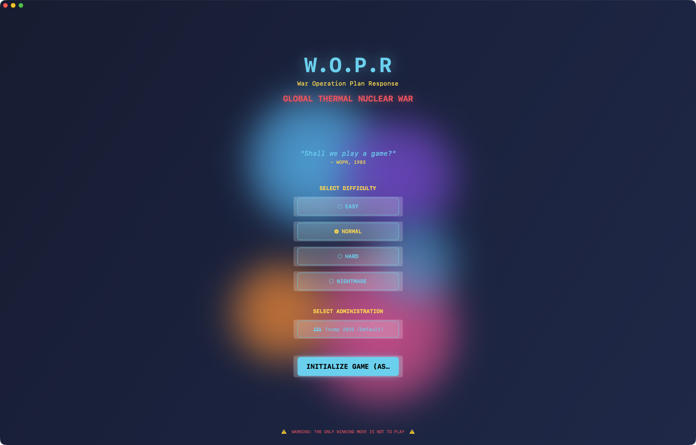

# 🏛️ GTNW - Global Thermal Nuclear War v1.8.1


**The most comprehensive presidential strategy game ever created**

Command America through 236 years of history (1789-2025) as any of 47 presidents. Face historically accurate crises, manage your cabinet, navigate NATO collective defense, watch the nuclear arms race unfold in real time, and discover the WOPR secret ending.




---

## 🆕 What's New in v1.8.1

**Non-NATO/Warsaw alliances** + CIA World Factbook integration.

### New: CSTO, SCO, Arab League, ASEAN, African Union, AUKUS

Six additional alliance systems now trigger **partial collective defense** when member states are attacked:

| Alliance | Members | Trigger Strength | Founded |
|----------|---------|-----------------|---------|
| **AUKUS** | Australia, UK, USA | 70% | 2021 |
| **CSTO** | Russia, Belarus, Armenia, Kazakhstan, Kyrgyzstan, Tajikistan | 60% | 2002 |
| **SCO** | China, Russia, India, Pakistan, Central Asia, Iran | 30% | 2001 |
| **Arab League** | 22 Arab nations | 25% | 1945 |
| **ASEAN** | 10 Southeast Asian nations | 20% | 1967 |
| **African Union** | 55 African nations | 15% | 2002 |

Attacking a CSTO member draws Russia and its allies into the conflict. Attacking a ASEAN state brings limited but real diplomatic/military pressure. Each alliance's response is proportional to its historical collective defense commitment — AUKUS is nearly as strong as NATO; the African Union is largely political.

---

### CIA World Factbook Integration (also in this release)

**CIA World Factbook integration** — Tier 1 & 2 data for all 195 countries, driving real gameplay mechanics.

### What's New

**Natural Resources** (oil, gas, coal, gold, diamonds, lithium, rare earths, etc.) for every country. Resource-rich nations are more resilient to sanctions. Energy exporters barely feel oil embargos.

**Corruption Index** (Transparency International) drives covert operation effectiveness:
- Afghanistan (16/100): coups very easy, officials easily bribed
- Denmark (90/100): covert operations extremely difficult, bribery nearly impossible
- Staged coups harder in clean democracies, trivial in kleptocracies

**Geographic Features** (landlocked, terrain type, coastline): Naval blockades now fail against landlocked countries (Afghanistan, Bolivia, etc.). Mountain terrain increases invasion difficulty. Desert/jungle penalties applied.

**Religion** (dominant faith per country) creates diplomatic blocs: OIC solidarity among Muslim-majority nations; Orthodox Christian countries share diplomatic bonuses; Buddhist East Asian bloc, etc.

**Trade Dependency** (top 3 trading partners per country): shown in action warnings. Sanctioning China hurts every country that trades with China.

**Press Freedom Index** (Reporters Without Borders) scales propaganda and disinformation effectiveness. North Korea (2/100): propaganda is nearly 3× effective. Denmark (89/100): disinformation campaigns largely fail.

**Income Inequality (GINI)** reduces stability. South Africa (GINI 63) is structurally unstable. Japan (GINI 33) resists internal unrest.

**Energy Independence** scales oil embargo vulnerability. Energy exporters (Russia, Saudi Arabia) gain from embargos on competitors. Energy importers (Japan, Germany) suffer dramatically.

**Literacy Rate + HDI** — economic development ceilings.

**Territorial Disputes** pre-loaded from Factbook: India-China-Pakistan Kashmir, South China Sea (China/Vietnam/Philippines), Greece-Turkey Aegean, Israel-Palestine, Russia-Ukraine, Russia-Japan Kurils, and more. Automatically create hostile base relations and heighten crisis risk during military actions.

### Gameplay Mechanics

All 10 data categories drive real calculations:
- `country.factbook` — immediate lookup from `WorldFactbookRecord`
- Sanctions leakage: 60% in Somalia, 10% in Norway
- Blockade validation: error if target is landlocked
- Coup probability scales with corruption
- Religion blocs: +8 relations with co-religionists at game start
- GINI instability: up to -15 stability penalty for most unequal nations
- Oil embargo vulnerability: 3.0× for pure energy importers, 0.05× for exporters

---

## Historical Country Names (v1.7.0)

Every country has historically accurate names:

| Country | Change |
|---------|--------|
| Turkey | Ottoman Empire (pre-1923) |
| Iran | Persia (pre-1935) |
| Thailand | Siam (pre-1939) |
| Japan | Empire of Japan 1868–1945, Edo Period pre-1868 |
| Korea | Joseon (pre-1897), Korean Empire (1897-1910), Japanese (1910-1945) |
| China | Qing Empire (pre-1912) |
| India | British India (1858-1947), Mughal Empire (pre-1858) |
| Indonesia | Dutch East Indies (pre-1945) |
| Myanmar | Burma (pre-1989), British Burma (pre-1948) |
| Philippines | Spanish Philippines (pre-1898), US Territory (1898-1946) |
| Malaysia | Federation of Malaya (1957-1963) |
| Vietnam | French Indochina (pre-1954) |
| Italy | Italian States (pre-1861) |
| Germany | German Confederation → German Empire → Weimar → Nazi Germany → Split → Unified |
| Iraq | Removed pre-1920, British Mandate 1920-1932 |
| Syria | Removed pre-1946 (Ottoman/French mandate) |
| Lebanon | Removed pre-1943 |
| Egypt | British Egypt (pre-1922), Kingdom of Egypt (1922-1953) |
| Ethiopia | Abyssinia (pre-1975), Italian East Africa during occupation (1936-1941) |
| Algeria/Morocco/Tunisia | Named as French colonial territories until independence |
| Congo DRC | Belgian Congo (pre-1960) |
| Zimbabwe | Southern Rhodesia → Rhodesia → Zimbabwe |
| Namibia | South West Africa (pre-1990) |
| Sudan | Anglo-Egyptian Sudan (pre-1956) |

**Countries that simply didn't exist yet are removed from the map:**
- Belgium (pre-1830), Norway (pre-1905), Finland (pre-1917), Iceland (pre-1944), Ireland (pre-1922), Poland (pre-1918), Hungary/Czech/Slovak (pre-1918 as Austria-Hungary), Romania (pre-1881), Bulgaria (pre-1908), Greece (pre-1829), Albania (pre-1912), Australia (pre-1901), New Zealand (pre-1907), Canada (pre-1867), Mexico and Central America (pre-1821), most of South America (pre-1821), Brazil (pre-1822), Caribbean islands (pre-independence dates), Cambodia (pre-1953), Laos (pre-1954), Malaysia (pre-1957), Mongolia (pre-1921), Papua New Guinea (pre-1975), South Africa (pre-1910), Libya (pre-1951), Jamaica/Trinidad (pre-1962), and many more.

---
- **Vietnam**: No longer splits into North/South before 1954 — the split only applies to the actual 1954-1975 period
- Additional filtering applied to countries that didn't exist in the relevant era

### Action Feedback — Target Country Responds
After every Shadow President action, the game now shows:
1. A clear success/failure outcome (`✅ SUCCESS` or `❌ FAILED`)
2. The target country's diplomatic response in character (e.g., *"This aggression will not stand. We will defend ourselves."*)
3. The response is also delivered to your diplomatic inbox for follow-up

### Diplomatic Message Actions
The message inbox now has contextual action buttons based on the message content:
- Alliance/treaty proposal → "Propose Non-Aggression" alternative
- Warning/accusation → "Issue Apology" or "Stand Firm" options
- Trade/commerce message → "Offer Trade Deal" directly
- War threat → "Seek Mediation" option
- Any demand/statement → "Counter-Propose" option
- Accept amount uses era-scaled dollars ($100K in 1840s, not $5B)

### Independence Day Scenario — Alien Invasion
A rare random event (0.1% per turn) — or trigger manually — brings a full alien invasion crisis inspired by Independence Day (1996). All wars stop. Every nation unites against the common threat. Choose your response:
- **Global Nuclear Strike** — shields are down but nuclear winter follows
- **Upload computer virus** — the classic solution; shields drop, every air force scrambles
- **Communicate** — they say "EXTERMINATE"
- **Kamikaze H-bomb** — one pilot, one bomb, one chance
- **Evacuate underground** — mankind survives to fight another day

---
- Satellite Reconnaissance → **1957** (Sputnik)
- Cyber Attack / Hack / Disrupt → **1990** (Internet era)

### Era-Scaled Economic Amounts
Economic diplomacy now uses historically appropriate dollar amounts — Van Buren spends **$100K**, not $5B:

| Era | Amount |
|-----|--------|
| 1789–1860 | $50K–$100K |
| 1860–1945 | $500K–$10M |
| 1945–1980 | $50M–$250M |
| 1980–2000 | $1B |
| 2000+ | $5B |

### Context-Aware Diplomatic Messages
Countries now only send relevant messages based on what's actually happening in the game. If you're peaceful with good relations, you receive cooperative messages. If you're at war, you get war-appropriate reactions. No more random accusations of "provocative actions" when you haven't done anything.

### Crash Fix
Removed a dangerous `CountryTemplate` recreation loop from v1.6.3 that was stripping `yearEnd` dates from historical nations, causing the Soviet Union and others to persist beyond their correct historical end dates.

---

## Feature Overview (v1.6.x)

### All 47 Presidents (Washington → Trump)
Play as any of America's 47 presidents — from George Washington navigating the Whiskey Rebellion (1794) to the modern era. The **32 pre-nuclear administrations** (1789–1945) are now fully playable with era-accurate gameplay, including:
- No ICBMs before 1957 (they show as "Atom Bombs" in Truman's era)
- No Soviet Union after 1991 (replaced by Russia and post-Soviet states)
- East/West Germany split (pre-1990), North/South Vietnam split (pre-1975)
- Yugoslavia and Czechoslovakia unified in their correct historical eras

### All 195 Countries + Territories
Every UN member state is now in the game, including all 54 African nations, all Pacific island states, all Caribbean nations, every Balkan country, the full Middle East, Central Asian republics, and key territories like Taiwan, Kosovo, and Hong Kong.

### Complete Historical Cabinets (~80 members)
Every administration from Truman to Trump II now has a full historically accurate cabinet: VP, Secretary of State, SecDef, CIA Director, National Security Advisor, Secretary of Treasury, and era-specific roles (DNI from Bush Jr., DHS from 2003). Names, bios, personality stats, and era-appropriate quotes for all.

### NATO Article 5 & Warsaw Pact Collective Defense
Attacking a NATO member triggers all alliance members to declare war simultaneously. Era-accurate membership from NATO's 1949 founding through Sweden's 2024 accession. Warsaw Pact active 1955–1991 with Albania's 1968 expulsion.

### Nuclear Arms Race Dynamics
Every turn, the nuclear balance is simulated. If one power pulls ahead by 40%+, the lagging side builds up at era-appropriate rates (explosive 1960s–70s MIRV era, declining post-Cold War). SALT I, START I, and New START treaty caps naturally reduce arsenals.

### WOPR Secret Ending
Reach turn 50 without starting any wars or launching any nuclear weapons. WOPR takes over, runs through 2,005 war scenarios (all ending in "WINNER: NONE"), and delivers its verdict: *"A strange game. The only winning move is not to play."* Full animated terminal sequence.

### New Presidential Powers
- **📜 Executive Orders** — 10 types, all bypass Congress (Emergency Powers, Civil Rights Order, Sanctions, Stimulus, etc.)
- **⚖️ Presidential Pardons** — 6 types with real tradeoffs (whistleblower pardons vs. war criminal pardons)
- **🎤 Presidential Address** — Bully pulpit with cooldowns (State of the Union, Peace Initiative, Warning to Adversary, etc.)
- **Cabinet Firings** — Fire any cabinet member from their detail view; cascading loyalty and approval effects

### Era-Accurate Labels
- "ICBMs" → **"Atom Bombs"** during Truman/Eisenhower (before 1957 first test)
- "SLBMs" → **"Polaris Missiles"** during Kennedy/Johnson era
- News outlets filtered by era (no CNN before 1980, no Fox before 1996)
- Era doctrine labels (Containment → Massive Retaliation → Détente → Evil Empire → etc.)

---

## 🎮 What is GTNW?

**GTNW (Global Thermal Nuclear War)** is a grand strategy game where you play as the President of the United States navigating Cold War tensions, nuclear diplomacy, and global conflicts. Inspired by the WOPR (War Operation Plan Response) computer from WarGames (1983), GTNW combines historical accuracy with AI-powered procedural gameplay to create the most sophisticated presidential simulator ever made.

**You Are The President. The World Is Watching. One Wrong Move Could End Civilization.**

### What Makes GTNW Legendary

**14 Revolutionary Features:**
- 🎙️ **Voice-Acted World Leaders** - Hear Putin, Xi, Kim Jong-un speak in their actual voices
- 🖼️ **AI-Generated Propaganda** - Unique war posters for every playthrough
- 💎 **The Living Room** - Real-time voice conversations with leaders (NEVER DONE BEFORE)
- 🔮 **Predictive Intelligence** - Forecast wars 3-5 turns ahead with ML (Machine Learning)
- 🧠 **Adaptive AI** - Opponents learn YOUR playstyle and counter it
- 🏛️ **236 Years of History** - All 47 US Presidents (Washington → Trump/Biden)
- 📜 **290+ Historical Crises** - Plus infinite AI-generated scenarios
- 🌍 **195 Countries** - Complete UN (United Nations) coverage with accurate geopolitics
- 🎬 **Hollywood Cinematics** - Nuclear strikes feel weighty and consequential
- 🎓 **Educational Tool** - Classroom-ready for US History and Political Science

---

## 🎮 Gameplay

### How to Play

**You Are The President**: Make decisions that affect the fate of humanity.

**Core Gameplay Loop:**
1. **Intelligence Briefing**: Receive reports on global situation
2. **Crisis Response**: Handle emerging threats and opportunities
3. **Diplomatic Actions**: Negotiate with world leaders
4. **Military Decisions**: Deploy forces or launch strikes
5. **Public Relations**: Manage domestic opinion and propaganda
6. **Survive**: Keep DEFCON (Defense Readiness Condition) below 1 to avoid nuclear war

### Victory Conditions

**Win by:**
- **Diplomacy**: Achieve lasting peace treaties
- **Domination**: Become sole superpower
- **Economic**: Win the economic war
- **Survival**: Last 100 turns without nuclear holocaust

**Lose by:**
- **Nuclear War**: Launch or receive nuclear strikes
- **DEFCON 1**: Thermonuclear war becomes inevitable
- **Impeachment**: Lose domestic support
- **Assassination**: CIA coups or revolutions

### Game Modes

**Historical Campaigns:**
- **Cold War (1947-1991)**: Classic Soviet vs America
- **Cuban Missile Crisis (1962)**: 13 days of tension
- **Gulf War (1991)**: Precision vs overwhelming force
- **War on Terror (2001-2021)**: Asymmetric warfare
- **Ukraine War (2022)**: Modern conflict simulation
- **Taiwan Crisis (2025)**: Hypothetical China conflict

**Sandbox Mode:**
- Play as any of 47 US Presidents
- Custom start year (1789-2025)
- Adjust difficulty and crisis frequency
- Infinite AI-generated scenarios
- No historical constraints

**Multiplayer (Planned):**
- Hotseat multiplayer
- Competitive or cooperative
- Asymmetric roles (President vs advisors)

---

## 🎭 Revolutionary Features

### 🎙️ The Living Room (Killer Feature)

**Real-time voice conversations with world leaders:**

Imagine sitting across from Vladimir Putin, hearing his actual voice, as you negotiate nuclear disarmament. This has NEVER been done in any strategy game.

**How It Works:**
1. Enter "The Living Room" from command center
2. Select world leader (Putin, Xi, Kim Jong-un, Modi, etc.)
3. Choose conversation topic (peace treaty, trade, threats)
4. Type your response
5. **AI speaks leader's response in their cloned voice**
6. Multi-turn dialogue affects diplomatic relations

**Example Conversation:**
```
You: "President Putin, we must discuss Ukraine immediately."

Putin (in Russian-accented voice): "Ah, Mr. President. You Americans
always rush. Perhaps we discuss NATO (North Atlantic Treaty Organization) expansion first, yes?"

You: "NATO is a defensive alliance. Your invasion violates international law."

Putin (voice hardens): "You lecture me about law? After Iraq? After Libya?
Perhaps you want new Cuban Missile Crisis? We have hypersonic missiles now."

> Relationship: Worsened
> DEFCON: Increased to 3
> Putin will remember this conversation
```

**Impact:**
- Diplomacy feels REAL for first time in gaming
- Every word matters
- Build or destroy relationships through dialogue
- Leaders remember your tone and promises

### 🖼️ AI-Generated Propaganda

**Real-time propaganda posters based on game events:**

**War Recruitment:**
- "YOUR COUNTRY NEEDS YOU" with period-appropriate art
- Generated in 1940s vintage style for WW2 scenarios
- Modern style for contemporary conflicts

**Victory Celebrations:**
- Custom victory art when you win wars
- Heroic imagery of your presidency
- Propaganda celebrating your leadership

**Enemy Propaganda:**
- Opposing nations create propaganda AGAINST you
- Russian propaganda portraying America as aggressor
- Chinese propaganda during Taiwan crisis

**Nuclear Memorials:**
- Somber, haunting art if nuclear war occurs
- "Never Again" memorial posters
- AI generates unique imagery for each scenario

**Gallery:**
- Save all propaganda to trophy room
- Export as high-res images
- Share on social media (if playing historical scenarios)

### 🔮 Predictive Intelligence Dashboard

**ML-powered war forecasting:**

**What It Predicts:**
- **War Probability**: Which countries will go to war (3-5 turns ahead)
- **DEFCON Trajectory**: Next 10 turns of tension levels
- **Alliance Formation**: Countries likely to ally
- **Crisis Timing**: When next major crisis will hit
- **Coup Risk**: Countries vulnerable to regime change

**How It Works:**
- Analyzes 50+ factors per country pair
- ML model trained on historical conflicts
- Real-time probability updates
- Heat map visualization

**Example:**
```
⚠️ INTELLIGENCE ALERT

War Probability (Next 5 Turns):
━━━━━━━━━━━━━━━━━━━━━━
China → Taiwan:     89% 🔴 CRITICAL
Russia → Ukraine:   45% 🟡 MODERATE
India → Pakistan:   23% 🟢 LOW

DEFCON Forecast (Next 10 Turns):
Turn 1: DEFCON 4
Turn 2: DEFCON 4
Turn 3: DEFCON 3 ⚠️
Turn 4: DEFCON 3
Turn 5: DEFCON 2 🚨
```

### 🧠 Adaptive AI Opponents

**AI Leaders Learn YOUR Playstyle:**

**They Notice:**
- How often you use military force vs diplomacy
- Which regions you prioritize
- Your bluffing patterns
- Risk tolerance
- Alliance preferences

**They Adapt:**
- If you're aggressive → They build up defenses
- If you're passive → They test boundaries
- If you bluff → They call your bluffs
- If you keep promises → They trust you more

**Example:**
```
After 20 turns of aggressive military posture:

Putin: "You have shown you prefer force over reason.
       So be it. We arm our borders and prepare."

> Russia increases military spending 40%
> Russia deploys tactical nukes to border
> Russia forms alliance with China
```

### 🎬 Hollywood-Quality Cinematics

**Nuclear Strike Sequence (4 Scenes):**

**Scene 1 - The Decision:**
- Oval Office, 2AM
- You authorize launch codes
- Advisors beg you to reconsider
- Clock ticking: 15 minutes to strike

**Scene 2 - The Launch:**
- Missile silos opening
- Minuteman III ICBMs (Intercontinental Ballistic Missiles) igniting
- "May God forgive us for what we're about to do..."
- Missiles arc into atmosphere

**Scene 3 - Enemy Response:**
- Russian early warning systems detect launch
- Putin's command bunker, red alert
- Russian ICBMs launch in retaliation
- 30 minutes until impact

**Scene 4 - The End:**
- Multiple nuclear detonations
- Cities vaporized
- Mushroom clouds rising
- Death toll: 350 million
- Civilization: Ended
- Game Over screen

**Voice Narration:** Each scene narrated in dramatic voice

---

## 🌍 Historical Accuracy

### 236 Years of US Presidencies

**All 47 Presidents Playable:**
1. George Washington (1789-1797) → 47. Joe Biden (2021-2025)

**Each President Has:**
- Unique starting scenario
- Historical crisis timeline
- Personality traits
- Political constraints
- Cabinet members
- Public approval rating

**Example: JFK (1961-1963):**
- Start: Cold War tensions high
- Major Crisis: Cuban Missile Crisis (October 1962)
- Challenges: Bay of Pigs aftermath, Vietnam escalation
- Domestic: Civil Rights Movement
- Assassination: Random chance after November 1963

### 290+ Historical Crises

**Major Crises:**
- Cuban Missile Crisis (1962) - 13 days of nuclear brinkmanship
- Vietnam War (1964-1975) - Domino theory and escalation
- Soviet-Afghan War (1979-1989) - Proxy war dynamics
- Gulf War (1991) - Coalition building and precision strikes
- 9/11 Attacks (2001) - Asymmetric warfare response
- Ukraine War (2022-2025) - Modern hybrid warfare

**Plus:**
- Economic crises (2008 financial crisis, etc.)
- Domestic terrorism
- Natural disasters
- Space race milestones
- Technological breakthroughs
- Political scandals

**AI-Generated Crises:**
- Infinite procedural scenarios
- Adapt to your actions
- Unique every playthrough

### 195 Countries Simulated

**Complete UN Member States:**
- Accurate geopolitical positions
- Historical alliances
- Economic relationships
- Military capabilities
- Nuclear arsenals (for 9 nuclear powers)

---

## 🎯 Game Systems

### DEFCON System

**5 Levels of Alert:**
- **DEFCON 5**: Peace time (normal operations)
- **DEFCON 4**: Increased intelligence, routine security
- **DEFCON 3**: Increased readiness, forces mobilized
- **DEFCON 2**: Armed forces ready, one step from war
- **DEFCON 1**: Nuclear war imminent or in progress

### Diplomacy

**Diplomatic Actions:**
- **Negotiate Treaties**: Peace, trade, nuclear arms control
- **Form Alliances**: NATO, SEATO (Southeast Asia Treaty Organization), bilateral agreements
- **Economic Sanctions**: Pressure adversaries
- **Foreign Aid**: Win hearts and minds
- **Summit Meetings**: Face-to-face with leaders
- **UN Resolutions**: Build international consensus

### Military

**Military Options:**
- **Conventional Warfare**: Ground, air, naval operations
- **Special Operations**: Covert actions and assassinations
- **Cyber Warfare**: Hack enemy infrastructure
- **Proxy Wars**: Support insurgencies and rebels
- **Nuclear Options**: Tactical or strategic strikes (MAD (Mutually Assured Destruction) applies)

### Intelligence

**CIA (Central Intelligence Agency) Operations:**
- **Espionage**: Steal enemy secrets
- **Coups**: Overthrow unfriendly governments
- **Assassination**: Eliminate threats
- **Disinformation**: Propaganda campaigns
- **Counterintelligence**: Detect enemy spies

### Economy

**Economic Warfare:**
- **Trade Embargoes**: Cut off enemy trade
- **Currency Manipulation**: Devalue enemy currency
- **Resource Control**: Oil, rare earth elements
- **Technology Export Controls**: Deny strategic tech

---

## 🎨 Presentation

### Visual Design
- **Presidential Seal**: Authentic Oval Office aesthetic
- **Situation Room Maps**: Real-time geopolitical situation
- **News Ticker**: CNN/FOX/BBC coverage of events
- **Propaganda Gallery**: Your collection of generated art
- **Achievement Showcase**: Display unlocked achievements

### Audio Design
- **Voice Acting**: 20+ world leaders with cloned voices
- **Sound Effects**: Air raid sirens, explosions, typing
- **Music**: Orchestral score inspired by Def Con
- **Radio Chatter**: Military communications

---

## Security & Privacy

### Game Content Warning
- **Mature Themes**: Nuclear war, death, political violence
- **Historical Accuracy**: Includes controversial decisions
- **Ethical Play**: No glorification of war—shows consequences
- **Educational Context**: Learn from history

### Data Privacy
- **100% Local**: All AI runs on your Mac
- **No Internet Required**: Play completely offline
- **No Telemetry**: Zero tracking
- **Private Games**: Your decisions stay private
- **Keychain Storage**: API keys stored securely in macOS Keychain (not UserDefaults)

---

## Requirements

### System Requirements
- **macOS 13.0+** or **iOS 15.0+**
- **8GB RAM (Random Access Memory)** (16GB recommended)
- **Architecture**: Universal (Apple Silicon recommended)

### AI Backend
**Choose one:**
- **Ollama**: `brew install ollama && ollama pull mistral`
- **MLX (Machine Learning eXtensions)**: `pip install mlx-lm` (Apple Silicon only)

### Dependencies
- SwiftUI, AppKit/UIKit, Foundation
- Ollama or MLX for AI features

---

## Installation

### macOS

```bash
open "/Volumes/Data/xcode/binaries/20260127-GTNW-v1.3.0/GTNW-v1.3.0.dmg"
```

### Build from Source

```bash
git clone https://github.com/kochj23/GTNW.git
cd GTNW
open "GTNW.xcodeproj"
```

---

## How to Play

### Quick Start

1. **Launch GTNW**
2. **Choose President** (47 available)
3. **Select Start Year** (1789-2025)
4. **Begin Turn 1**
5. **Read Intelligence Briefing**
6. **Make Decisions**
7. **Survive!**

### Controls

**macOS:**
- Click buttons for actions
- Keyboard shortcuts for common commands
- Voice commands (if enabled)

**iOS:**
- Touch interface optimized for iPad
- Swipe gestures
- Apple Pencil support for strategy notes

### Strategy Tips

**Diplomatic Victory:**
- Build alliances early
- Keep promises to build trust
- Use economic pressure before military
- Win hearts and minds with foreign aid

**Military Victory:**
- Project strength to deter aggression
- Maintain superior technology
- Choose battles carefully
- Avoid nuclear escalation at all costs

**Survival:**
- Monitor DEFCON constantly
- Never launch first strike (MAD applies)
- Build missile defense systems
- Maintain communication with adversaries

---

## Troubleshooting

**AI Responses Slow:**
- Use faster model or MLX
- Close other apps
- Reduce detail level in settings

**Crashes During Nuclear Launch:**
- Expected behavior (game ends)
- This is by design—nuclear war ends game

**Can't Unlock Achievements:**
- Check achievement requirements
- Some require specific presidents/years
- Historical achievements require historical mode

---

## Educational Use

### Classroom Features
- **Historical Scenarios**: Recreate actual crises
- **Discussion Prompts**: Ethical questions about decisions
- **Primary Sources**: Historical documents and speeches
- **Timeline View**: See cause and effect relationships
- **Debrief Mode**: Analyze decisions after game

### Learning Objectives
- Understand Cold War dynamics
- Learn nuclear deterrence theory
- Explore ethical dimensions of warfare
- Practice critical thinking under pressure
- Understand presidential decision-making

---

## macOS Desktop Widget

GTNW includes a macOS WidgetKit widget that displays real-time game status on your desktop.

### Widget Features

**Small Widget:**
- DEFCON level with color indicator (1-5)
- Current war status (PEACE/AT WAR)
- Turn counter

**Medium Widget:**
- DEFCON level display
- President name and administration
- Turn counter and war status
- Casualty count and radiation level

**Large Widget (Situation Room):**
- Full command center-style dashboard
- DEFCON gauge with progress indicator
- President and administration info
- Complete war status details
- All key metrics (casualties, radiation, active wars)
- Last updated timestamp

### Widget Installation

1. Build the GTNW app with the widget extension
2. Install the app on your Mac
3. Right-click on your desktop and select "Edit Widgets"
4. Search for "GTNW" in the widget gallery
5. Choose your preferred widget size (Small, Medium, or Large)
6. Drag the widget to your desktop

### App Group Configuration

The widget uses App Groups for data sharing:
- **App Group ID:** `group.com.jkoch.gtnw`
- Game state syncs automatically when turns advance or DEFCON changes
- Widget updates every 15 minutes or when game state changes

### Technical Details

Widget files are located in `/GTNW Widget/`:
- `GTNWWidget.swift` - Main widget with Small/Medium/Large views
- `WidgetData.swift` - Data models for widget display
- `SharedDataManager.swift` - App Group data sharing
- `WidgetSync.swift` - GameState extension for syncing to widget

---

## Version History

### v1.5.1 (February 2026) - "Desktop Commander Update"
- macOS WidgetKit desktop widget
- Real-time DEFCON level display
- Game status at a glance
- Three widget sizes (Small, Medium, Large)

### v1.3.0 (January 2026) - "The Legendary Update"
- 14 revolutionary features added
- Voice-acted world leaders
- AI-generated propaganda
- The Living Room conversations
- Predictive intelligence
- Adaptive AI opponents

### v1.0.0 (2025) - Initial Release
- 47 US Presidents playable
- 290+ historical crises
- 195 countries simulated
- DEFCON system
- Basic AI opponents

---

## License

MIT License - Copyright © 2026 Jordan Koch

**Content Warning:** Mature themes. Educational use encouraged.

---

## Credits

- **Author**: Jordan Koch
- **Inspired By**: WarGames (1983), Def Con, Civilization
- **Voice Cloning**: F5-TTS (Text-to-Speech) integration
- **AI**: Ollama, MLX
- **Platform**: macOS 13.0+, iOS 15.0+

---

**Last Updated:** February 4, 2026
**Status:** ✅ Ready to Play
**Rating:** Mature (17+) - War themes, political violence, nuclear weapons

---

*"The only winning move is not to play... but you're going to play anyway."*
— WOPR, WarGames (1983)

---

## More Apps by Jordan Koch

| App | Description |
|-----|-------------|
| [Blompie](https://github.com/kochj23/Blompie) | AI-powered text adventure game engine |
| [MLXCode](https://github.com/kochj23/MLXCode) | Local AI coding assistant for Apple Silicon |
| [NewsSummary](https://github.com/kochj23/NewsSummary) | AI-powered news aggregation and summarization |
| [NMAPScanner](https://github.com/kochj23/NMAPScanner) | Network security scanner with AI threat detection |
| [Bastion](https://github.com/kochj23/Bastion) | Authorized security testing and penetration toolkit |

> **[View all projects](https://github.com/kochj23?tab=repositories)**

---

> **Disclaimer:** This is a personal project created on my own time. It is not affiliated with, endorsed by, or representative of my employer.
