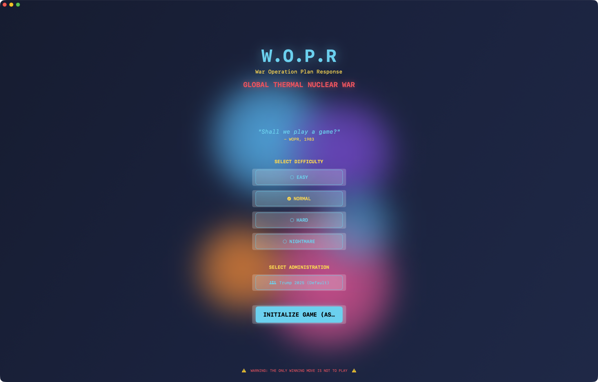
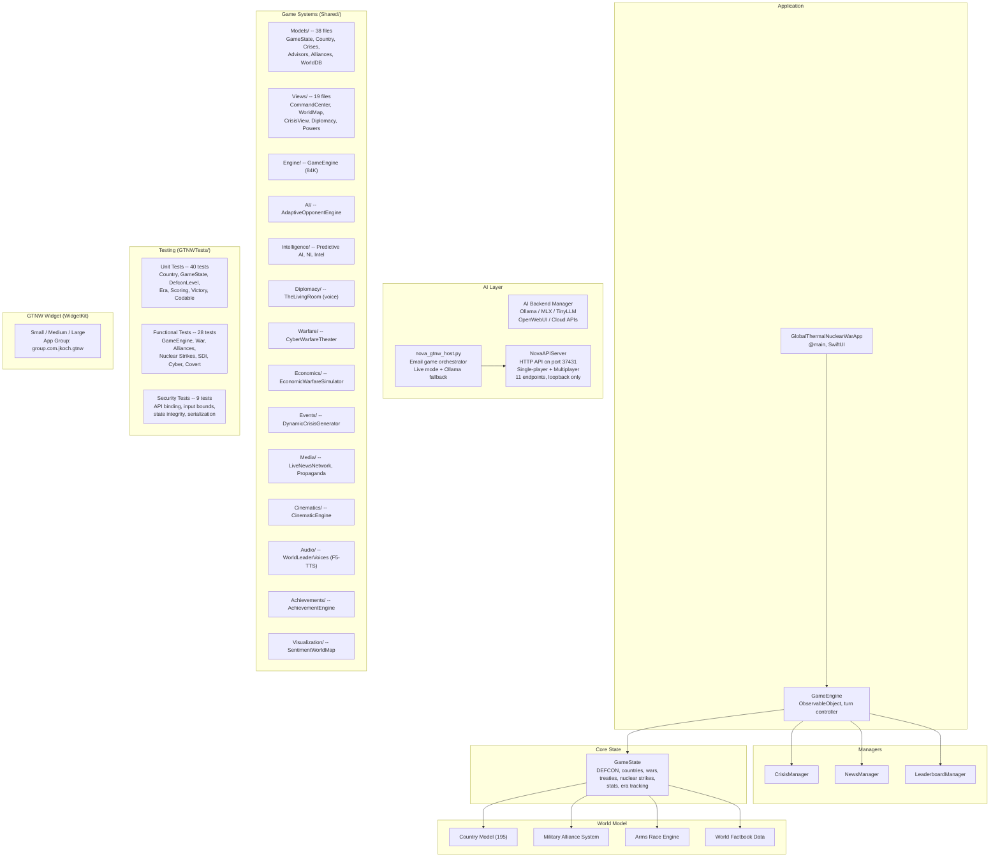

# GTNW -- Global Thermal Nuclear War


A grand strategy presidential simulator spanning 236 years of American history (1789--2025). Play as any of the 47 U.S. presidents, navigate historically accurate crises, manage nuclear arsenals, conduct diplomacy with 195 countries, and discover whether the only winning move really is not to play.

Inspired by the WOPR computer from WarGames (1983).

Written by Jordan Koch.

---

## Who plays each country? — a brain per country (PvP + PvE)

Every country can be driven by a different **brain**. Open the **BRAINS** panel in the
Command Center to assign any of these to any nation:

| Brain | What it is |
|-------|------------|
| **Human** | A person at the keyboard — no automated move is taken for that country. |
| **Rule-Based AI** | The fast built-in AI. **Default** for every non-player country, so existing behavior is preserved until you change assignments. Network-free. |
| **This Session (live PvP)** | A **live Claude Code session** answers that country's moves in real time — true player-vs-player. |
| **Gateway-Claude (always-on)** | An always-on opponent served by Nova Gateway (`:18792`) — no human session required. |
| **Local / frontier models** | Any OpenAI-compatible endpoint: local Ollama models (auto-discovered from `:11434/api/tags`) or frontier models via OpenRouter. |

Each turn, only countries whose brain is **not** rule-based make an LLM/session call, and
those calls run **concurrently** (a `TaskGroup`, off the main actor) — turns are dramatically
faster than the old serial path. Every remote call is bounded by a timeout: **if a brain
does not answer in time, that country falls back to rule-based AI**, so a turn never blocks
waiting on a human or a slow model.

### The true-PvP live-session bus

For "This Session" brains, GTNW POSTs a `MoveRequest` to a thin local bridge
(`tools/gtnw_coordination_bridge.py`) which parks it in `nova_ops.claude_coordination`
(topic `gtnw-move`, keyed by game/turn/country). A live Claude Code session answers by
writing a `MoveResponse` back onto the row; GTNW polls for it and applies it. GTNW talks
**HTTP to the bridge** rather than embedding a Postgres client, keeping the app free of a
heavy pinned SPM dependency. See `migrations/2026-08-18_gtnw_coordination_moves.sql` for the
row schema. Until the bridge (or an equivalent gateway route) is running, live-session calls
simply time out and fall back — harmlessly.



---

## Architecture


```mermaid
graph TD
    subgraph Application
        App["GlobalThermalNuclearWarApp<br/>@main, SwiftUI"]
        App --> GE["GameEngine<br/>ObservableObject, turn controller"]
    end

    subgraph Managers
        GE --> CM["CrisisManager"]
        GE --> NM["NewsManager"]
        GE --> LM["LeaderboardManager"]
    end

    subgraph "Core State"
        GE --> GS["GameState<br/>DEFCON, countries, wars,<br/>treaties, nuclear strikes,<br/>stats, era tracking"]
    end

    subgraph "World Model"
        GS --> Country["Country Model (195)"]
        GS --> Alliance["Military Alliance System"]
        GS --> Arms["Arms Race Engine"]
        GS --> Factbook["World Factbook Data"]
    end

    subgraph "AI Layer"
        AIB["AI Backend Manager<br/>Ollama / MLX / TinyLLM<br/>OpenWebUI / Cloud APIs"]
        Nova["NovaAPIServer<br/>HTTP API on port 37431<br/>Single-player + Multiplayer<br/>11 endpoints, loopback only"]
        Herd["nova_gtnw_host.py<br/>Email game orchestrator<br/>Live mode + Ollama fallback"]
        Herd --> Nova
    end

    subgraph "Game Systems (Shared/)"
        Models["Models/ -- 38 files<br/>GameState, Country, Crises,<br/>Advisors, Alliances, WorldDB"]
        Views["Views/ -- 19 files<br/>CommandCenter, WorldMap,<br/>CrisisView, Diplomacy, Powers"]
        Engine["Engine/ -- GameEngine (84K)"]
        AI["AI/ -- AdaptiveOpponentEngine"]
        Intel["Intelligence/ -- Predictive AI, NL Intel"]
        Diplo["Diplomacy/ -- TheLivingRoom (voice)"]
        Warfare["Warfare/ -- CyberWarfareTheater"]
        Econ["Economics/ -- EconomicWarfareSimulator"]
        Events["Events/ -- DynamicCrisisGenerator"]
        Media["Media/ -- LiveNewsNetwork, Propaganda"]
        Cine["Cinematics/ -- CinematicEngine"]
        Audio["Audio/ -- WorldLeaderVoices (F5-TTS)"]
        Achieve["Achievements/ -- AchievementEngine"]
        Viz["Visualization/ -- SentimentWorldMap"]
    end

    subgraph "Testing (GTNWTests/)"
        UnitTests["Unit Tests -- 40 tests<br/>Country, GameState, DefconLevel,<br/>Era, Scoring, Victory, Codable"]
        FuncTests["Functional Tests -- 28 tests<br/>GameEngine, War, Alliances,<br/>Nuclear Strikes, SDI, Cyber, Covert"]
        SecTests["Security Tests -- 9 tests<br/>API binding, input bounds,<br/>state integrity, serialization"]
    end

    subgraph Widget["GTNW Widget (WidgetKit)"]
        W["Small / Medium / Large<br/>App Group: group.com.jkoch.gtnw"]
    end
```

---

## Features

### 47 Playable Presidents

Every president from George Washington (1789) through the modern era. Each has a unique starting scenario, historical crisis timeline, personality traits, cabinet members with real names and stats, and era-appropriate constraints. The 32 pre-nuclear administrations (Washington through FDR) are fully playable with era-accurate gameplay -- no ICBMs in 1837.

### 195 Countries with Full Geopolitical Simulation

All UN member states plus key territories (Taiwan, Kosovo, Hong Kong). Every country has accurate coordinates, capital, GDP, population, military stats, nuclear arsenal data (for the nine nuclear powers), and CIA World Factbook integration providing natural resources, corruption index, geographic features, religion, trade dependencies, press freedom, income inequality, energy independence, literacy rate, and HDI.

### Era-Accurate Historical Country Sets

Countries that did not exist yet are removed from the map. The Soviet Union appears only from 1922--1991. East and West Germany split from 1945--1990. North and South Vietnam split from 1954--1975. Yugoslavia and Czechoslovakia are unified in their correct eras. Colonial territories use their historical names (Ottoman Empire, British India, Persia, Siam, and dozens more).

### 750+ Historical Crises with Infinite AI-Generated Scenarios

Over 290 hand-authored crises covering the Whiskey Rebellion (1794) through the Ukraine War (2022), plus AI-generated procedural scenarios that adapt to player actions. Crises span Cuban Missile Crisis brinkmanship, economic collapses, domestic terrorism, space race milestones, and political scandals.

### Nuclear Arms Race Dynamics

Every turn, the nuclear balance is simulated. If one power pulls ahead by 40% or more, the lagging side builds up at era-appropriate rates (explosive 1960s--70s MIRV era, declining post-Cold War). SALT I, START I, and New START treaty caps naturally reduce arsenals. All nine nuclear states have SIPRI/FAS-sourced warhead, ICBM, SLBM, and bomber counts with full historical coverage from first test to 2025.

### Military Alliance Collective Defense

NATO Article 5 triggers all members to declare war when any member is attacked. Era-accurate membership from 1949 through Sweden's 2024 accession. Warsaw Pact active 1955--1991. Six additional alliances (AUKUS, CSTO, SCO, Arab League, ASEAN, African Union) provide partial collective defense scaled to their historical commitment strength.

### The Living Room -- Voice Diplomacy

Real-time voice conversations with world leaders using F5-TTS voice cloning. Multi-turn dialogue affects diplomatic relations. Leaders remember tone, promises, and betrayals.

### Adaptive AI Opponents

AI leaders track player behavior -- aggression frequency, bluffing patterns, alliance preferences, risk tolerance -- and adjust their strategy accordingly. Aggressive players face arms buildups; passive players get tested.

### Predictive Intelligence Dashboard

ML-powered war forecasting predicting conflict probability 3--5 turns ahead, DEFCON trajectory, alliance formation likelihood, crisis timing, and coup risk.

### AI-Generated Propaganda

War recruitment posters, victory celebrations, enemy propaganda, and nuclear memorial art generated in real time based on game events. Period-appropriate styling (1940s vintage for WWII, modern for contemporary conflicts).

### Presidential Powers

- **Executive Orders** -- 10 types, all bypass Congress (Emergency Powers, Civil Rights, Sanctions, Stimulus, and more)
- **Presidential Pardons** -- 6 types with real tradeoffs
- **Presidential Address** -- Bully pulpit with cooldowns (State of the Union, Peace Initiative, Warning to Adversary)
- **Cabinet Firings** -- Dismiss any advisor with cascading loyalty and approval effects

### DEFCON System

Five levels from DEFCON 5 (peacetime) to DEFCON 1 (nuclear war imminent). Every action, crisis response, and diplomatic failure pushes the needle. Hollywood-quality cinematic sequences play for nuclear strike events.

### WOPR Secret Ending

Reach turn 50 without starting any wars or launching nuclear weapons. WOPR takes over, runs 2,005 war scenarios (all ending WINNER: NONE), and delivers its verdict: "A strange game. The only winning move is not to play." Full animated terminal sequence with typewriter effect.

### macOS Desktop Widget

WidgetKit extension with three sizes. Small shows DEFCON level and war status. Medium adds president name and turn counter. Large provides a full Situation Room dashboard with all key metrics. Updates via App Group data sharing.

### Multiplayer via Email

Nova-hosted email games for group play. A Python orchestrator (`nova_gtnw_host.py`) assigns countries to herd members, emails crisis briefings each turn, processes reply decisions, and posts results to Slack. Works in two modes:

- **Live mode** -- GTNW app running, NovaAPIServer manages real game state
- **Simulation mode** -- GTNW not running, Ollama generates crises and tracks decisions locally

Players receive Markdown-formatted crisis briefings by email and reply with a single digit (0--3) to submit their decision. Nova acknowledges each reply and posts turn summaries to Slack.

```bash
# Host a Cuban Missile Crisis game for the group
nova_gtnw_host.py start --year 1962 --scenario "Cuban Missile Crisis"
nova_gtnw_host.py advance     # advance turn, email crisis briefings
nova_gtnw_host.py check       # scan inbox, process replies, post to Slack
nova_gtnw_host.py status      # check session state
nova_gtnw_host.py reset       # end game and clear state
```

### Local HTTP API

NovaAPIServer runs on port 37431 (loopback only, `127.0.0.1`). It exposes both single-player session management and multiplayer coordination endpoints.

#### Single-Player Endpoints

```
GET    /api/status                       App status, uptime, session count
GET    /api/ping                         Health check
GET    /api/administrations              List all 47 playable presidents
GET    /api/game/sessions                List active game sessions
POST   /api/game/new                     Start a new single-player session
GET    /api/game/:id/state               Full game state for session
GET    /api/game/:id/crisis              Active crisis (if any)
POST   /api/game/:id/crisis/resolve      Resolve crisis with chosen option
POST   /api/game/:id/turn                End turn and advance game
POST   /api/game/:id/action              Take a game action
DELETE /api/game/:id                     End and delete session
```

#### Multiplayer Endpoints (for nova_gtnw_host.py / Herd email games)

```
GET  /api/status             Includes multiplayerSessionCount field
GET  /api/game-state         Full state of the active multiplayer session
POST /api/start-session      Start session: {"president":"Nixon","year":1972,"scenario":"..."}
GET  /api/crises             Active crises requiring player decisions
POST /api/decision           Submit decision: {"crisis_id":"...","choice":0,"player":"Sam"}
GET  /api/history            Recent turn events and decision log
POST /api/assign-countries   Assign countries: {"assignments":{"USA":"Sam","USSR":"O.C."}}
```

One multiplayer session is active at a time (the herd game model). Country assignments map player names to country IDs, decisions are logged with timestamps, and history tracks the last 50 events.

---

## AI Backend

GTNW supports multiple AI backends for crisis generation, diplomatic dialogue, and opponent behavior. All AI runs locally by default -- no internet required.

| Backend    | Description                                    |
|------------|------------------------------------------------|
| Ollama     | HTTP API, localhost:11434, any supported model  |
| MLX        | Python MLX Toolkit, Apple Silicon native        |
| TinyLLM    | Lightweight LLM server, localhost:8000          |
| TinyChat   | Fast chatbot interface by Jason Cox             |
| OpenWebUI  | Self-hosted AI platform, localhost:8080         |
| OpenAI     | GPT-4o, DALL-E 3 (optional cloud)              |
| Google AI  | Vision, Speech, Translation (optional cloud)    |
| Azure      | Cognitive Services (optional cloud)             |
| AWS AI     | Rekognition, Polly, Comprehend (optional cloud) |
| IBM Watson | NLU, Speech, Discovery (optional cloud)         |
| Auto       | Automatically choose best available backend     |

When no AI backend is available, GTNW falls back to an enhanced deterministic AI that remains challenging.

---

## Installation

### DMG Installer (Recommended)

GTNW is distributed as a DMG installer. It is not available on the Mac App Store.

1. Download the latest DMG from [GitHub Releases](https://github.com/kochj23/GTNW/releases)
2. Open the DMG and drag GTNW to your Applications folder
3. Launch GTNW from Applications
4. (Optional) Install Ollama for AI features: `brew install ollama && ollama pull mistral`

### Build from Source

Requires Xcode 15+ and Swift 5.9.

```bash
git clone https://github.com/kochj23/GTNW.git
cd GTNW
open GTNW.xcodeproj
```

Build targets:
- **GTNW_macOS** -- macOS 13.0+ (Ventura), universal binary
- **GTNW_iOS** -- iOS 15.0+, iPhone and iPad

The macOS build runs without app sandbox for full system access. The widget extension uses App Group `group.com.jkoch.gtnw` for data sharing.

---

## System Requirements

| Requirement    | Minimum           | Recommended        |
|----------------|-------------------|--------------------|
| macOS          | 13.0 (Ventura)    | 14.0+ (Sonoma)     |
| iOS            | 15.0              | 17.0+              |
| RAM            | 8 GB              | 16 GB              |
| Architecture   | Intel or Apple Silicon | Apple Silicon   |
| AI Backend     | None (fallback)   | Ollama or MLX      |

---

## How to Play

1. Launch GTNW
2. Choose a president (any of 47, Washington through modern era)
3. Select a start year (1789--2025) or a historical scenario
4. Read your intelligence briefing
5. Respond to crises, conduct diplomacy, manage military operations
6. Monitor DEFCON -- if it reaches 1, nuclear war begins
7. Pursue victory through diplomacy, domination, economic supremacy, or survival

### Victory Conditions

- **Diplomatic Victory** -- achieve lasting peace treaties
- **Domination** -- become the sole superpower
- **Economic Victory** -- win the economic war
- **Survival** -- last 100 turns without nuclear holocaust
- **WOPR Ending** -- 50 turns with zero wars and zero launches

### Defeat Conditions

- Nuclear war (launch or receive strikes)
- DEFCON reaches 1 with no resolution
- Impeachment (domestic support collapses)
- Assassination (coups or revolutions)

---

## Technical Details

### Source Layout

```
GTNW/
  GTNW.xcodeproj/            Xcode project (macOS + iOS targets)
  Package.swift               Swift Package Manager descriptor
  Shared/                     All shared source (both platforms)
    Engine/                   GameEngine -- core turn loop (84K)
    Models/                   38 files: GameState, Country, Crises,
                              Advisors, Alliances, World DB, Factbook,
                              AI backends, Presidential Powers, etc.
    Views/                    19 SwiftUI views: CommandCenter, WorldMap,
                              TextCommandInterface, CrisisView, etc.
    AI/                       AdaptiveOpponentEngine
    Intelligence/             PredictiveIntelligence, NaturalLanguageIntel
    Diplomacy/                TheLivingRoom (voice conversations)
    Warfare/                  CyberWarfareTheater
    Economics/                EconomicWarfareSimulator
    Events/                   DynamicCrisisGenerator
    Media/                    LiveNewsNetwork, PropagandaEngine
    Cinematics/               CinematicEngine (nuclear strike sequences)
    Audio/                    WorldLeaderVoices (F5-TTS integration)
    Achievements/             AchievementEngine
    Visualization/            SentimentWorldMap
    NovaAPIServer.swift       HTTP API server (port 37431)
                              Single-player + multiplayer endpoints
  GTNW/
    AICapabilities/           UnifiedAI, Voice, ImageGen, Analysis, Security
  GTNW Widget/                WidgetKit extension (Small/Medium/Large)
    GTNWWidget.swift          Widget views
    SharedDataManager.swift   App Group data bridge
    WidgetData.swift          Data models
```

### Key Technologies

- **SwiftUI** with AppKit integration on macOS
- **Combine** for reactive state management
- **WidgetKit** for macOS desktop widgets
- **NWListener** (Network framework) for the local HTTP API server
- **Security framework** for Keychain credential storage
- **F5-TTS** for voice cloning of world leaders
- **Ollama / MLX** for local AI inference

### Data Scale

- 47 presidents with full cabinets (~80 unique cabinet members)
- 195 countries with GDP, population, military, nuclear arsenal, and CIA Factbook data
- 750+ historical crises (290+ hand-authored, rest procedurally generated)
- 6 military alliance systems with era-accurate membership
- 9 nuclear states with decade-by-decade arsenal data from first test to 2025
- Historical country name changes for 30+ nations across all eras
- 10 CIA World Factbook data categories driving gameplay mechanics
- Era-gated technology flags (cyber warfare 1990+, satellites 1957+, drones 2001+)

### Privacy and Security

- 100% local by default -- no internet required for core gameplay
- No telemetry, no tracking, no data collection
- API keys stored in macOS Keychain (never in UserDefaults or source)
- HTTP API bound to loopback only (127.0.0.1)
- App sandbox disabled on macOS for full system integration

---

## Testing

GTNW includes a comprehensive XCTest suite covering unit, functional, and security tests. Tests are organized across three files:

### Test Summary

| Suite | Tests | Coverage |
|-------|-------|----------|
| **Unit Tests** | 40 | Country model, GameState, DefconLevel, era systems, scoring, victory conditions, Codable, leaderboard |
| **Functional Tests** | 28 | GameEngine lifecycle, war/alliance, diplomacy, nuclear strikes, SDI, cyber defense, covert ops, DEFCON management |
| **Security Tests** | 9 | API port binding, input bounds, state integrity, data uniqueness, serialization round-trip, resource abuse |
| **Total** | **77** | **0 failures** |

### Running Tests

```bash
# Build and test via command line
xcodebuild -project GTNW.xcodeproj -scheme GTNW_macOS -configuration Debug \
  -destination 'platform=macOS' test

# Or open in Xcode and run with Cmd+U
open GTNW.xcodeproj
```

### Test Architecture

- **GTNWUnitTests.swift** -- Pure model and logic tests. No UI, no side effects. Validates country initialization, nuclear capability math, scoring formulas, era-gated technology, Codable round-trips, and all victory/defeat conditions.
- **GTNWFunctionalTests.swift** -- Game engine integration tests. Validates war declaration, alliance formation, nuclear strikes (including SDI interception), economic diplomacy, covert operations, and DEFCON escalation/de-escalation. All tests run on `@MainActor`.
- **GTNWSecurityTests.swift** -- Validates API server binds to correct port, all numeric values have proper floors (military, warheads, stability never go negative), diplomatic relations are clamped to [-100, 100], country IDs/codes are unique, nuclear powers have warheads, and game state serialization preserves all fields.

---

## Version History

| Version | Date       | Highlights                                                    |
|---------|------------|---------------------------------------------------------------|
| 2.0.0   | May 2026   | Full multiplayer API, Nova email game hosting (nova_gtnw_host.py) |
| 1.9.0   | May 2026   | XCTest suite (77 tests), warning fixes, QE pipeline           |
| 1.8.2   | March 2026 | Nuclear arsenal data accuracy, SIPRI/FAS sourced inventories  |
| 1.8.1   | March 2026 | Non-NATO alliances (CSTO, SCO, AUKUS, etc.), CIA Factbook     |
| 1.6.5   | March 2026 | AI nuclear buildup fix, action feedback, alien invasion event |
| 1.6.0   | March 2026 | All 47 presidents, 195 countries, cabinets, NATO/Warsaw Pact |
| 1.5.1   | Feb 2026   | macOS WidgetKit desktop widget                                |
| 1.3.0   | Jan 2026   | Voice-acted leaders, propaganda, Living Room, predictive AI   |
| 1.0.0   | 2025       | Initial release                                               |

See [CHANGELOG.md](CHANGELOG.md) for full details.

---

## Content Advisory

GTNW simulates nuclear war, political violence, covert operations, and historical atrocities with the goal of historical accuracy and education. It does not glorify war -- it shows consequences. Suitable for ages 17 and above. Designed to be used as an educational tool for U.S. history and political science courses.

---

## License

MIT License -- Copyright (c) 2025-2026 Jordan Koch

See [LICENSE](LICENSE) for the full text.

---

## Credits

Written by Jordan Koch ([kochj23](https://github.com/kochj23)).

Inspired by WarGames (1983), Civilization, and DEFCON.

Voice cloning powered by F5-TTS. AI backends powered by Ollama and MLX.

---

## More Apps by Jordan Koch

| App | Description |
|-----|-------------|
| [MLXCode](https://github.com/kochj23/MLXCode) | Local AI coding assistant for Apple Silicon |
| [NMAPScanner](https://github.com/kochj23/NMAPScanner) | Network security scanner with AI threat detection |
| [Blompie](https://github.com/kochj23/Blompie) | AI-powered text adventure game engine |
| [NewsSummary](https://github.com/kochj23/NewsSummary) | AI-powered news aggregation and summarization |
| [Bastion](https://github.com/kochj23/Bastion) | Authorized security testing and penetration toolkit |

[View all projects](https://github.com/kochj23?tab=repositories)

---

*"The only winning move is not to play... but you are going to play anyway."*
-- WOPR, WarGames (1983)

---

> Disclaimer: This is a personal project created on the author's own time. It is not affiliated with, endorsed by, or representative of any employer.
